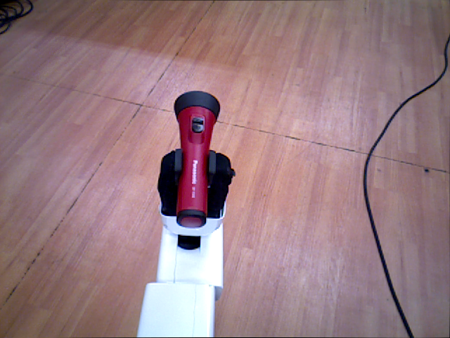
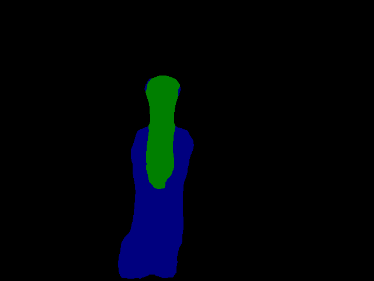

## Code to segment random objects held in HSR(Human Support Robot)'s gripper with deeplab v2 from RGB image.
## Test code
 - `python scripts/test_image_inhand.py
 - Sample result
   

    
   

   

    
   

