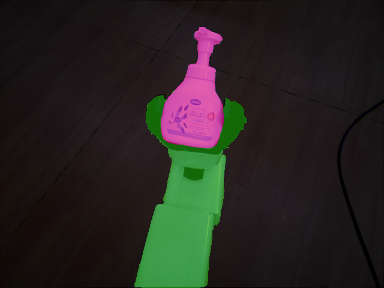
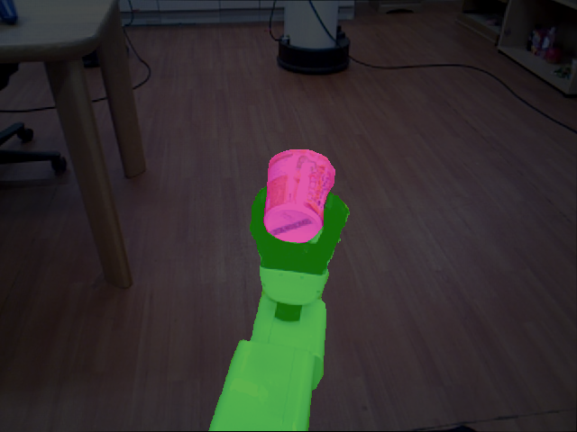
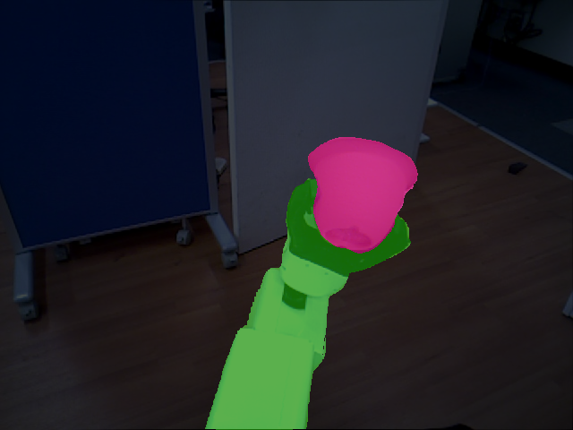

# Inhand HSR Robot Object Saliency Segmentation #
***

## Train Data ##
- Train data include 3 following categories
```text
background
robot_hand
inhand_object
```

- Segmentation Color Chart


- Data Samples

|  |  |
|:---:|:---:|
|  |  |

## Test code ##
***
 - `python scripts/test_image_inhand.py`
 - Sample result
   <p align="center">
    
   </p>
   <p align="center">
    
   </p>
